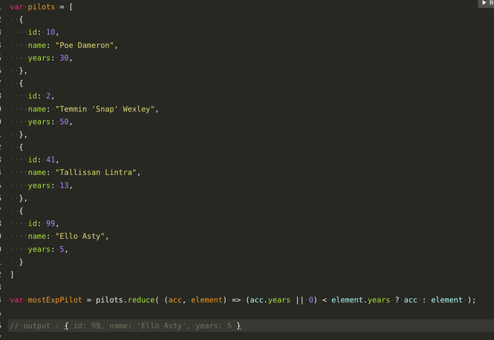

## Filter


### Exemple

> Intial data
```js
const user = {
  "admin": false,
  "user": true,
  "super": true
}
```
#### Output all true data from user object
> Solutions:
```js
Object.keys(user).filter(
  (k) => {
    return user[k]
  }
);
// Output: [ 'user', 'super' ]
```
```js
// shortland version
Object.keys(user).filter(
  (k) => user[k]
);
// Output: [ 'user', 'super' ]
```


## Map


## Reduce


## Exercice with reduce

