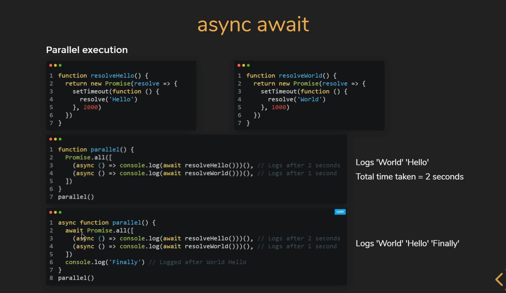

## Intro

!!! info

    - The async keyword is used to declare async functions
    - Async functions are functions that are instances of the AsyncFunction constructor
    - Unlike normal functions, async functions always return a promise

```js title="Normal function"
function greet() {
  return "Hello";
}
greet();
// browser console: "Hello"
```

```js title="async function"
async function greet() {
  return "Hello";
}
greet();
// browser console: Promise {<fulfilled>: "Hello"}
```

```js title="async function with promise"
async function greet() {
  return Promise.resolve("Hello");
}

greet().then(
  value => console.log(value)
);
// browser console: ‘Hello’
```

## Await

!!! info

    **Await** keyword can be put infront of any async promise based function to pause your code until that promise settles and returns its result await only works inside async functions. Cannot use await in normal functions

```js title="async with await"
async function greet() {
  let promise = new Promise((resolve, reject) => {
    setTimeout(() => resolve("Hello"), 1000)
  });

  let result = await promise; // await until the promise resolve

  console.log(result) ; // "Hello"
}

greet()
```

## Sequential execution

```js title="Function hello"
function resolveHello() {
  return new Promise(resolve => {
    setTimeout(() => resolve( ‘Hello’ ), 2000);
  }
};
```

```js title="Function world"
function resolveWorld() {
  return new Promise(resolve => {
    setTimeout(() => resolve( ‘Hello’ ), 2000);
  }
};
```

```js title="Sequential start"
async function sequentialStart() {
  const hello = await resolveHello();
  console.log(hello); // Logs me after 2 secondes

  const world = await resolveWorld();
  console.log(world); // Logs after 2 + 1 = 3 seconds
}
sequentialStart();
```

## Parrallel execution




## Chaining promises vs async-await


## Exo

