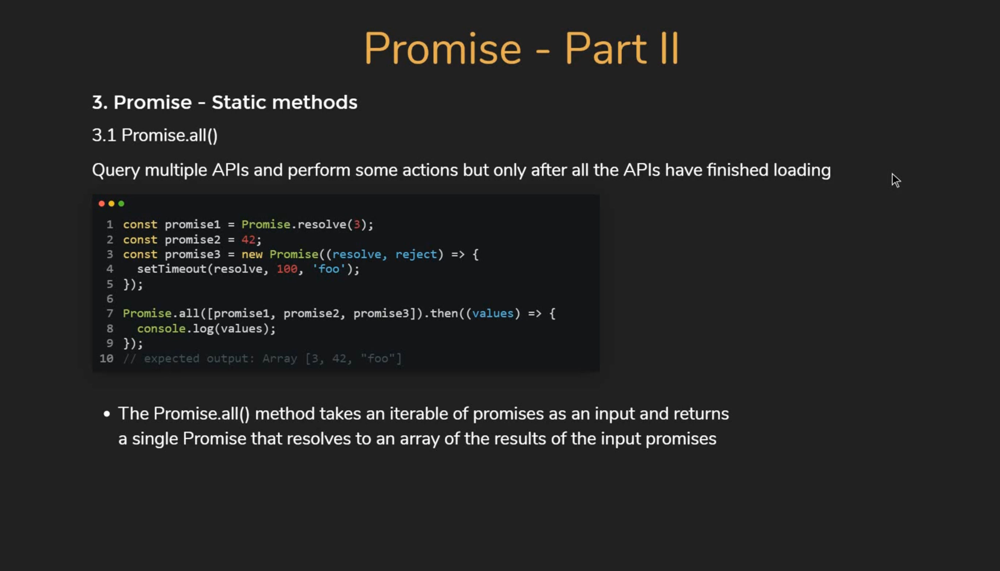
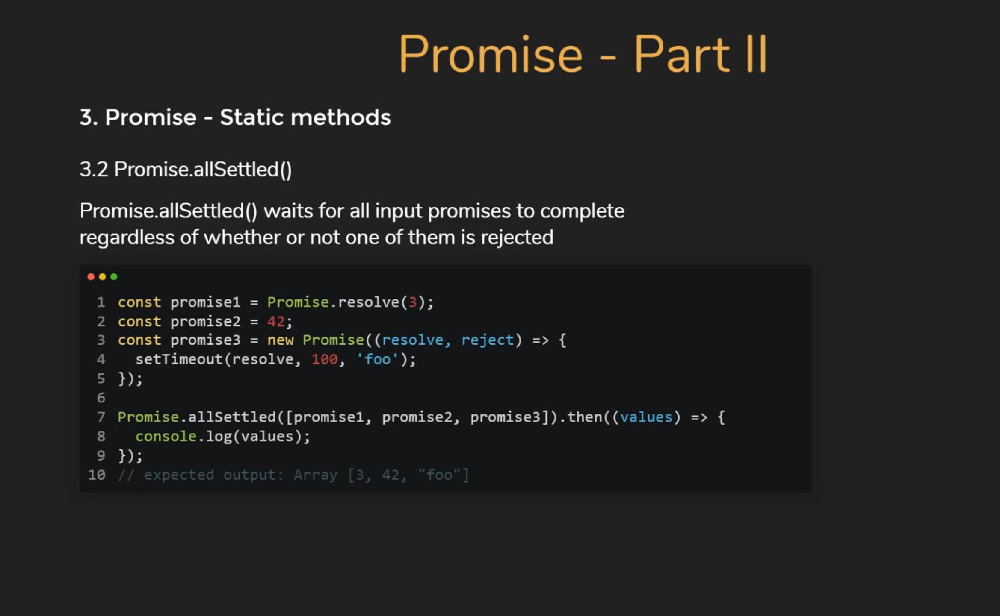

# Promise intro

> How to execute callback functions based on the status change?

```js title="Promise Resolve scenario"
const promise1 = new Promise((resolve, reject) => {
  setTimeout(() => {
    // Food truck found
    // Change status from ‘pending’ to 'fulfilled'
    resolve("Bringing tacos")
  }, 5000);
});
```

```js title="Promise Reject scenario"
const promise2 = new Promise((resolve, reject) => {
  setTimeout(() => {
    // Food truck not found
    // Change status from ‘pending’ to 'rejected'
    reject('Not bringing tacos. Food truck not there.');
  }, 5000);
});
```

```js title="Success and failure callbacks"

const onFullfillment = (result) => {
  // resolve was called
  console. log(result);
  console.log('Set up the table to eat tacos');
}

const onRejection = (error) => {
  // reject was called
  console.log(error);
  console.log('Start cooking pasta');
}

promise1.then(onFullfillment);
promise2.catch(onRejection);
```

```js title="console log result"
'Bringing tacos'
'Set up the table to eat tacos'
-------------------------------
'Cannot bring tacos'
'Start cooking pasta'
```

## Promise then() function

### Version 1

* Encouraged approach
* Even if your onFulfillment callback throws an exception, it is caught and then you can handle that exception gracefully

```js title="then() and catch() functions"
const promise = new Promise((resolve, reject) => {
  resolve() or reject()
});

promise.then(onFulfillment);
promise.catch(onRejection);
```

### Version 2

* onRejection callback handles error from only the Promise.
* If your callback functions itself throws an error or exception, there is no code to handle that.

```js title="then() function"
const promise = new Promise((resolve, reject) => {
  resolve() or reject()
});

promise.then(onFulfillment, onRejection)
```

## Chaining Promise


## Promise Static methods

### Promise All



### Promise Race


### Promise allSettle



## Bonus

### Promise with for..of
> Ouput the user ID with 1000 ms delay one per one

```js
// Create the promise with timeout
const getUserID = (id) => {
  return new Promise( (resolve) => {
		setTimeout(() => {
      console.log(`Got user ID ${id}`);
      resolve(id);
	  },1000);
  })
}
```

```js
( async function() {
	const users = [30,20,10,5,1];
  for (const user of users) {
  	await getUserID(user)
  }
})()

// output at 1000 ms frequence one per one the users (5 x 1000 ms):

// 'Got user ID 30' >1000 ms
// 'Got user ID 20' >1000 ms
// 'Got user ID 10' >1000 ms
// 'Got user ID 5'  >1000 ms
// 'Got user ID 1'  >1000 ms
```

### Promise with forEach, map or for

```js
// with forEach, map, for, it run in parrallels
users.forEach( async(user) => {
  await getUserID(user)
})
// output with 1000 ms delay All the users in one time:
```