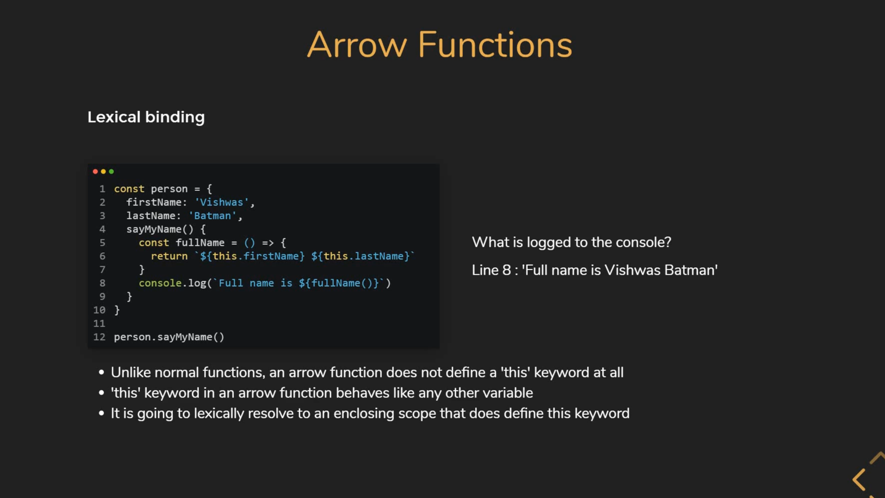
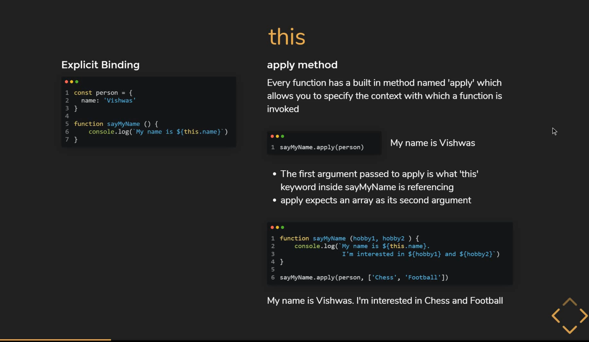
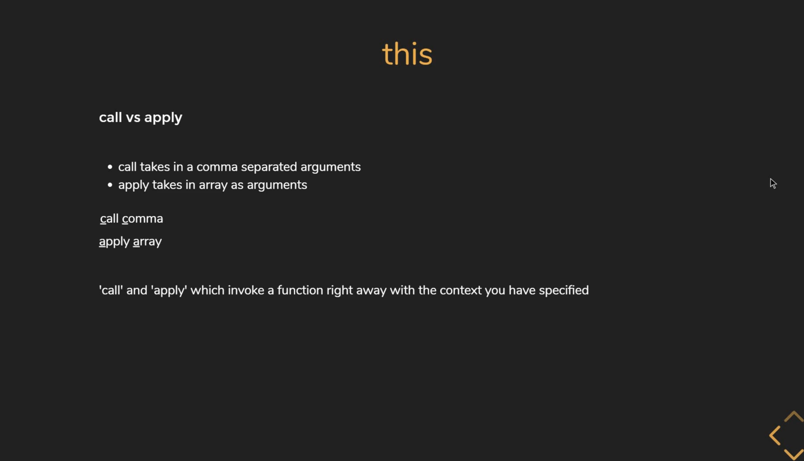
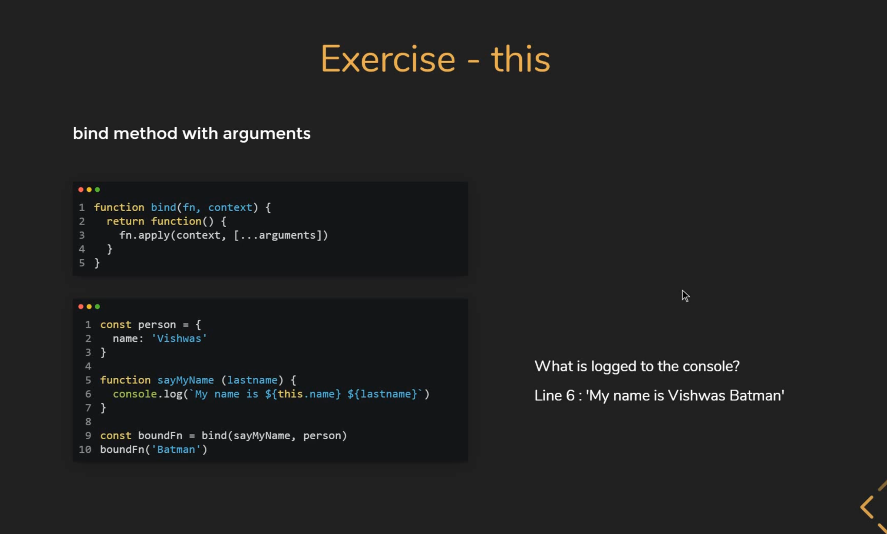

## This with Arrow fonction

## This without Arrow fonction

## This with New

## This Implicit Binding

## This with Object : implicit Binding

## This with-bind

## This with-call

## This with-apply

## This apply-vs-call

## Exercices

### Binding args

### Explicit binding

### Implicit binding

