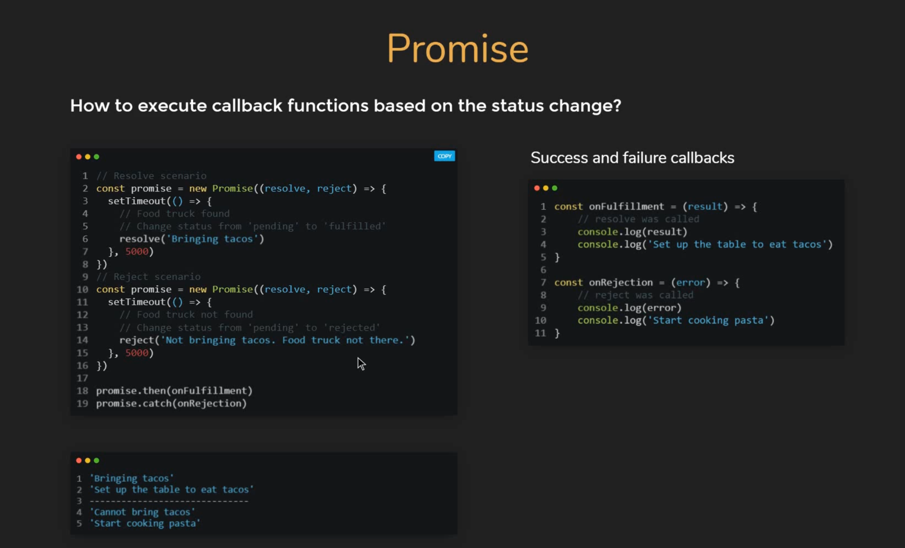
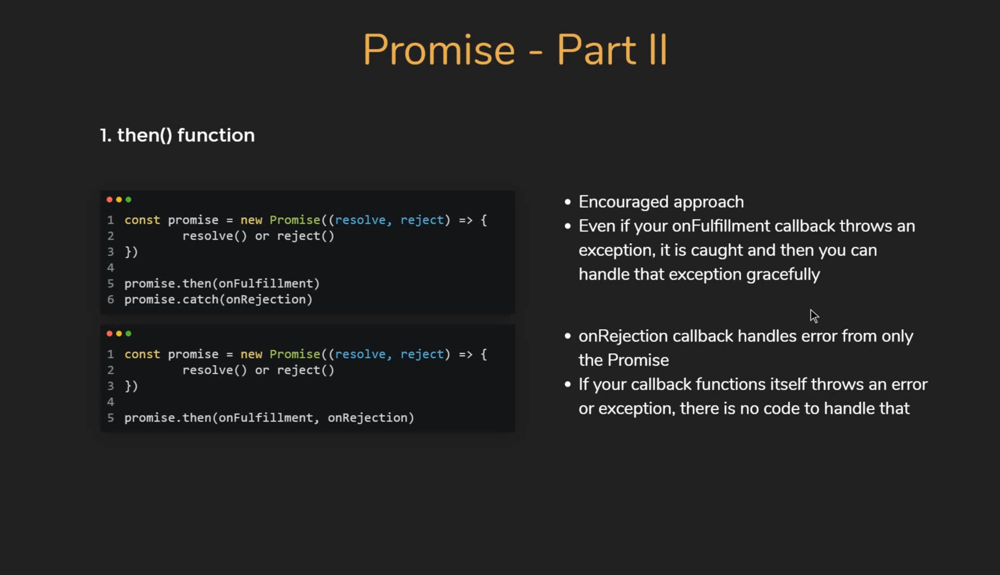
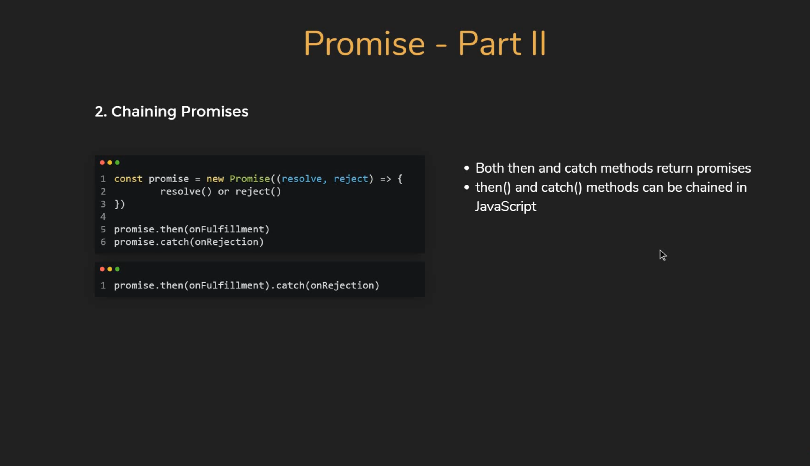
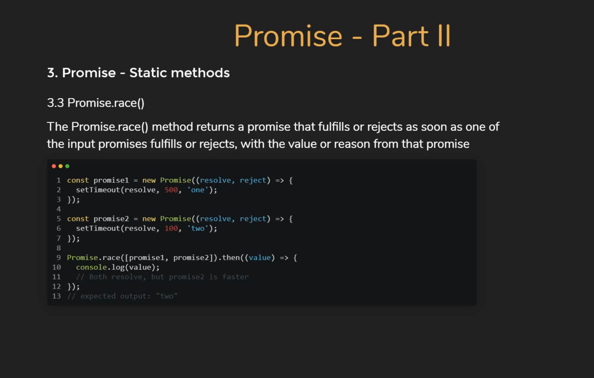

# Promise intro



## Promise then() function



## Chaining Promise



## Promise Static methods

### Promise All


### Promise Race



### Promise allSettle


## Bonus

### Promise with for..of
> Ouput the user ID with 1000 ms delay one per one

```js
// Create the promise with timeout
const getUserID = (id) => {
  return new Promise( (resolve) => {
		setTimeout(() => {
      console.log(`Got user ID ${id}`);
      resolve(id);
	  },1000);
  })
}
```

```js
( async function() {
	const users = [30,20,10,5,1];
  for (const user of users) {
  	await getUserID(user)
  }
})()

// output at 1000 ms frequence one per one the users (5 x 1000 ms):

// 'Got user ID 30' >1000 ms
// 'Got user ID 20' >1000 ms
// 'Got user ID 10' >1000 ms
// 'Got user ID 5'  >1000 ms
// 'Got user ID 1'  >1000 ms
```

### Promise with forEach, map or for

```js
// with forEach, map, for, it run in parrallels
users.forEach( async(user) => {
  await getUserID(user)
})
// output with 1000 ms delay All the users in one time:
```