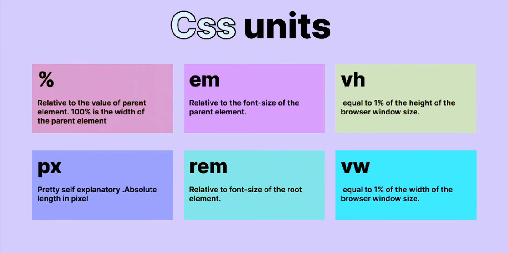
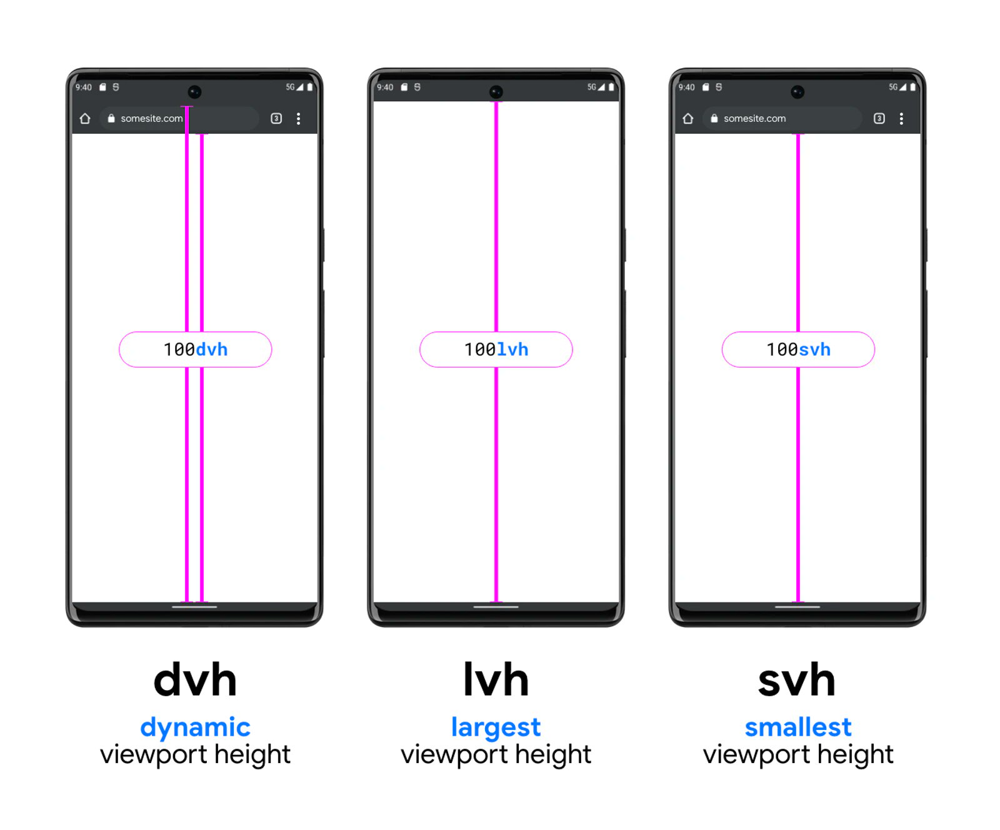

# CSS Units



## px (absolute)

*Pretty self explanatory absolute lenght in pixel*

!!! info

        **Avoid using `pixel` for font-sizes. Use mostly for small details like `border` and `shadow`.**

> - Fixed in size
> - Not responsive
> - Overrides user's browser preference

---

## % (relative)

*Relative to the value of parent element. 100% is the width of the parent element*

!!! info

        **I recommend using percentages for layouts and width/height. For example, laying out links on navbar, placing images inside a div ...**

> - Size is defined as percentage of another value (mostly parent element)
> - Sometimes size is defined as percentage of the element itself

---

## vw / vh (relative)

*Equal to 1% of the height or width of the browser window size*

`vw` stands for Viewport Width and represents a percentage of the width of the viewport. The number placed before `vw` is the percentage of the width of the viewport this length will be. For example if you wrote `10vw` then this would represent a length of `10%` of the width of your viewport.

!!! important

        The viewport is just a fancy word for the size of your screen, so if you were on a large desktop with a width of 1920px, 10vw would represent 192px. If you were instead on a mobile phone with a width of 300px, then 10vw would only be 30px.

`vh` stands for Viewport Height and is the exact same as vw but for the height instead of the width. These two units can be used in combination to easily make an element fill the entire size of the screen.

```css
.full-screen {
        width: 100vw;
  height: 100vh;
}
```

!!! info

        **vh/vh are relative to the width/height of the browser window. 100vw means full width of the screen. Use vw/vh for bigger layouts, like background.**

> - Useful for responsive website because everything scales.

---

## em (relative)

*Relative to the font-size of the parent element.*

!!! info

        **You can use `em` for font-size and margin/padding. Use `em` when you want to adjust margin/padding based on that element's font-size** *(if you font-sized is big, you maybe want bigger spacing)*

> - Changes behavior based on property
> - 1 em = parent font-size
> - if parent doesn't have a size, defaults to 16 px (body)

---

## rem (relative)

*Relative to the font-size of the root element*

!!! info

        **You can also use `rem` for font-size and margin/padding.** *`rem`is easier to work than `em` because its more consistent.*

> - Relative to the root HTML, no matter what (default is 16px)
> - You can change the root HTML size. For exemple if you change it to 20px,
> 1 rem will always 20 px.

---

## dvh / lvh / svh (relative)

*For mobile screen height*


