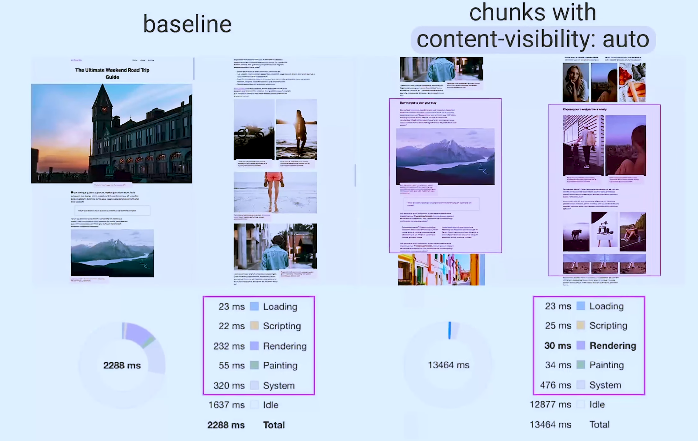

# Modern HTML5

## Client-side form validation

[Doc Mozilla sur la validation HTML](https://developer.mozilla.org/en-US/docs/Learn/Forms/Form_validation)

#### HTML Tag validation

Use tag validation (type, min, max ...) with **required** if data is required.

```html
<input type='username' name="username" min="2", max="12" required>
```

Use it for data-validation in form :


#### Input form with js

Use form with javascript for trigger input element.

```html
<form onsubmit="myFunction()">
    Enter name : <input type="text" name="fname">
</form>
```

## SEO

#### Open Graph (for social) in meta

use OG meta for your social media SEO


```html
<html xmlns:og="http://ogp.me/ns#">

<head>

<title>Open Graph : pourquoi utiliser les balises OGP ?</title>

<meta property="og:title" content="Article sur l'Open Graph par Referenseo" />

<meta property="og:type" content="article" />

<meta property="og:url" content="http://www.yakaferci.com/open-graph/" />

<meta property="og:image" content="http://referenseo/images/open-graph.jpg" />

<meta property="og:site_name" content="Agence de référencement Referenseo" />

...

</head>

...

</html>
```

[Link to OG]([▷ Open Graph : Le SEO et les balises OGP [Guide Ultime SEO] - ReferenSEO](https://www.referenseo.com/guide-seo/open-graph/))

#### Semantic

use Semantic HTML5 element instead of div.


## Performance

#### Content visibility

Le content visibility increase your css performance loading !



[Toutes les info sur le content visibility ici]([content-visibility: the new CSS property that boosts your rendering performance](https://web.dev/content-visibility/))

#### Async / Defer

Instead to put script below body for HTML loading, use *async* or *defer*


# Web component


# Shadow DOM


