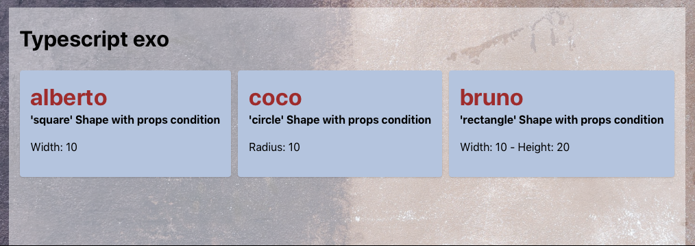

# Conditional type

## Create a basic component with conditional props

```ts title="Create types"
interface CircleProps {
  shape: 'circle';
  radius: number;
}

interface SquareProps {
  shape: 'square';
  width: number;
}

interface ReactangleProps {
  shape: 'rectangle';
  width: number;
  height: number;
}
```
> Here `shape` is the differ property

```ts title="Create the conditional type"
type DrawerProps = CircleProps | SquareProps | ReactangleProps;
```

```ts title="Use DrawerProps in a component"
function Drawer(props: DrawerProps) {
  return (
    <div>
      <h1>'{props.shape}' Shape with props condition</h1>
      {props.shape === 'circle' && <p>Radius: {props.radius}</p>}
      {props.shape === 'square' && <p>Width: {props.width}</p>}
      {props.shape === 'rectangle' && <p>Width: {props.width} - Height: {props.height}</p>}
    </div>
  );
}
```

```ts title="Simplier way to create DrawerProps"
type DrawerProps = { shape: 'circle'; radius: number }
  | { shape: 'square'; width: number }
  | { shape: 'rectangle'; width: number; height: number }
);
```

> Now add a common property : `fullname` with `&` :

```ts title="DrawerProps with fullname"
type DrawerProps = { fullname: string } & (
  | { shape: 'circle'; radius: number }
  | { shape: 'square'; width: number }
  | { shape: 'rectangle'; width: number; height: number }
);
```

> Create the final component :

```ts title="Drawer.tsx"
function Drawer(props : DrawerProps) {
  return (
    <Paper shadow="xs" p="md" >
      <Title order={1} style={{color:"brown"}} >{props.fullname}</Title>
      <Title order={5}>'{props.shape}' Shape with props condition</Title>
      {props.shape === 'circle' && <p>Radius: {props.radius}</p>}
      {props.shape === 'square' && <p>Width: {props.width}</p>}
      {props.shape === 'rectangle' && <p>Width: {props.width} - Height: {props.height}</p>}
    </Paper>
  );
}
```

> Use the Drawer component in an app :

```ts title="App.tsx"
import Drawer from './components/typescript/Drawer';

function App() {
  return (
    <Container size="lg" style={{backgroundColor: "orange"}}>
      <h1>Typescript exo</h1>
      <Stack align="center" >
        <Group position="left" spacing="xs" >
          <Drawer fullname='alberto' shape='square' width={10} />
          <Drawer fullname='coco' shape='circle' radius={10} />
          <Drawer fullname='bruno' shape='rectangle' width={10} height={20} />
        </Group>
      </Stack>
    </Container>
  )
}

export default App
```



## Create a `collapsed` `expanded` component

The purpose is to have `collapsed` OR `expanded` property and not accepting both at same time.

